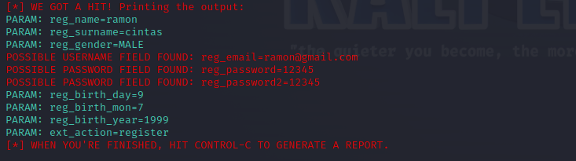

# Cybersecurity-Phishing

### DESCRIÇÃO
Neste desafio de projeto da (DIO) Digital Innovation One na formação cybersecurity specialist, foi implementado um Phishing para captura de dados utilizando:

- linguagens: Python, Shell script.
- Sistema operacional: Windows.
- Máquina virtual: Kali Linux.
- Interpretador de comando: Bash.
- Ferramenta: Setoolkit

# Resutados



### Comandos digitados
- Acesso root: ``` sudo su ```
- Iniciando o setoolkit: ``` setoolkit ```
- Tipo de ataque: ``` Social-Engineering Attacks ```
- Vetor de ataque: ``` Web Site Attack Vectors ```
- Método de ataque: ```Credential Harvester Attack Method ```
- Método de ataque: ``` Site Cloner ```
- Inserir o IP da máquina virtual 
- Se caso não souber o IP -> comando para saber o ip ``` ifconfig ```
- URL para clone: -> site usado como alvo:  https://www.mirtesnet.com.br/

# Observação: 
- Captura de dados: OK
